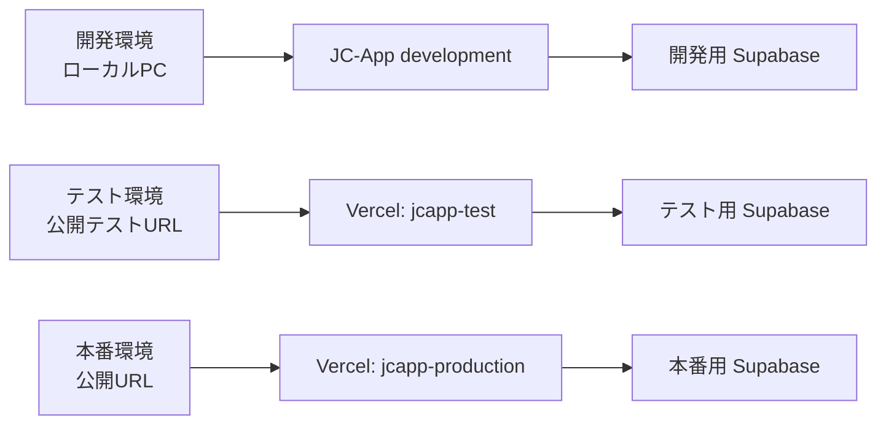

# 環境・デプロイ運用

## 1. 基本方針

JC-Appは次の3環境を完全に分離して運用します。Supabaseプロジェクト、Vercelプロジェクト、環境変数、管理権限を共有しません。



| 区分 | アプリの配置 | Supabase | `NEXT_PUBLIC_APP_ENV` | 用途 |
| --- | --- | --- | --- | --- |
| development | ローカルPC | 既存の開発用プロジェクト | `development` | 実装・画面確認 |
| test | Vercelのテスト専用プロジェクト | 新規のテスト用プロジェクト | `test` | 受入テスト・公開前確認 |
| production | 将来の本番専用プロジェクト | 将来の本番用プロジェクト | `production` | 実運用 |

## 2. 環境変数

すべての環境で同じ変数名を使用し、**値だけを環境ごとに変えます**。実際の値、Secret key、アクセストークンをGitHub、チャット、マニュアルへ記載しません。

| 変数名 | ブラウザへ公開 | 用途 |
| --- | --- | --- |
| `NEXT_PUBLIC_APP_ENV` | はい | `development` / `test` / `production` の表示・機能制御 |
| `NEXT_PUBLIC_SUPABASE_URL` | はい | その環境のSupabase Project URL |
| `NEXT_PUBLIC_SUPABASE_ANON_KEY` | はい | その環境のPublishable key |
| `NEXT_PUBLIC_SITE_URL` | はい | ログイン・招待のリダイレクト先URL |
| `SUPABASE_SECRET_KEY` | いいえ | 招待・アカウント発行などのサーバー専用処理 |

`NEXT_PUBLIC_` が付く値はブラウザで使われます。`SUPABASE_SECRET_KEY` はVercelまたはローカルのサーバー環境だけに設定し、画面・クライアントコード・ログへ出力しません。

### 設定例

`.env.example` は値を含まないテンプレートです。ローカルではコピーして `.env.local` を作り、開発用の値だけを設定します。テスト・本番の値はVercel Dashboardの **Project Settings > Environment Variables** に設定します。

| 設定先 | `NEXT_PUBLIC_APP_ENV` | Supabase接続先 |
| --- | --- | --- |
| 開発PCの `.env.local` | `development` | 開発用Supabase |
| `jcapp-test` のVercel Production環境 | `test` | テスト用Supabase |
| `jcapp-production` のVercel Production環境 | `production` | 本番用Supabase |

環境変数の変更は既存デプロイへは反映されません。変更後は必ず新しいデプロイを作成し、画面右上の環境バッジと `/settings` を確認します。

## 3. 新規Supabaseプロジェクトの作成

テスト用と本番用は、開発用とは別のSupabaseプロジェクトを作成します。

1. Supabase Dashboardで新しいプロジェクトを作成する。
2. Project Settings > APIでProject URLとPublishable keyを確認する。
3. Secret keyはProject Settings > API Keysで確認し、各環境のサーバー専用設定へだけ登録する。
4. Authentication > URL Configurationで、その環境の `NEXT_PUBLIC_SITE_URL` をSite URLに設定する。
5. Redirect URLsへ `<SITE_URL>/auth/callback` と `<SITE_URL>/auth/accept-invite` を追加する。
6. Authentication > Password Security、Rate Limits、Bot and Abuse Protectionを開発環境と同じ方針で設定する。

テスト用プロジェクトへ本番の会員、メールアドレス、出欠、資料、Authユーザー、認証情報をコピーしてはいけません。テストでは架空の会員・架空のメールアドレス・架空の資料だけを使用します。

## 4. SQL適用順

### 新規のテスト用・本番用Supabase: 正式な適用順

SQL Editorで、次の順番に**1ファイルずつ**実行します。各実行後に `Success. No rows returned` または正常完了を確認してから次へ進みます。

| 順番 | ファイル | 対象 | 備考 |
| --- | --- | --- | --- |
| 1 | `supabase/schema.sql` | テスト・本番 | 最新の全テーブル・列・監査ログテーブルを作成する。実行直後は開発用の暫定RLSがある。 |
| 2 | `supabase/seed.sql` | **テストのみ** | 架空の玉島青年会議所データを投入する。**本番では絶対に実行しない**。 |
| 3 | `supabase/production-rls.sql` | テスト・本番 | Auth自動紐付け、招待・初期パスワード用RPC、現在年度の管理権限判定、厳格なRLS・列権限をまとめて適用する。セキュリティ境界となる最後の主要SQL。 |
| 4 | `supabase/environment-test-data-migration.sql` | テスト・本番 | テストデータ追跡テーブルのRLSを明示的に最新化する。`can_manage_lom` に依存するため、必ず手順3の後に実行する。再実行可。 |

`production-rls.sql` には、`auth-auto-link-migration.sql`、`auth-invitation-rls-migration.sql`、`initial-password-migration.sql` と同等の最新RPC・権限設定が含まれています。したがって、**新規プロジェクトではこの3ファイルを追加実行する必要はありません**。重複実行してもRLSを緩める内容ではありませんが、同じ関数・ポリシーを再定義するだけなので、正式手順から外します。

`auth-schema-migration.sql`、`auth-invitation-migration.sql`、`auth-auto-link-migration.sql`、`auth-invitation-rls-migration.sql`、`initial-password-migration.sql`、`announcement-crud-migration.sql` は、過去の既存DBを段階更新するための互換migrationです。**空の新規プロジェクトには実行しません**。既存DBへ適用する場合だけ、現状を確認して必要なファイルを選び、最後に最新版の `production-rls.sql` を実行します。

`dev-grants.sql` はRLSを緩める開発補助用です。テスト環境・本番環境へ実行してはいけません。

### 4.1 成功確認と失敗時の再開

各SQLの実行直後に、SQL Editorの結果が `Success. No rows returned` であることを確認します。さらに、次の確認SQLを実行します。

```sql
-- テーブルとRLSの有効化を確認
select tablename, rowsecurity
from pg_tables
where schemaname = 'public'
  and tablename in ('members', 'fiscal_years', 'auth_invitation_audit_logs', 'development_test_data_runs')
order by tablename;

-- 本番RLSで必要なRPCがあることを確認
select routine_name
from information_schema.routines
where routine_schema = 'public'
  and routine_name in (
    'can_manage_lom',
    'link_current_member_by_email',
    'record_member_invitation',
    'activate_current_member_invitation',
    'complete_initial_password_change',
    'link_issued_member_account'
  )
order by routine_name;

-- テスト環境でseedを実行した場合だけ、架空LOMを確認
select name, slug from public.loms where slug = 'tamashima';
```

途中で失敗した場合は、**開発用・本番用プロジェクトへ切り替えず**、エラーが出た同じテスト用プロジェクトで止めます。エラー内容を確認して原因を解消した後、失敗したファイルだけを再実行します。`schema.sql` は実行後に暫定RLSを作り直すため、途中から再実行した場合は必ず `production-rls.sql` と `environment-test-data-migration.sql` を続けて再実行し、最後のRLS状態を戻します。`seed.sql` は固定IDの `upsert` ですが、架空データを更新するため、実在データを含む環境では再実行しません。

### 既存DBを更新するとき

既存プロジェクトの状態は環境ごとに異なります。適用前にバックアップ、既存テーブル、RLS、すでに実行済みのmigrationを確認します。`DROP`、`TRUNCATE`、本番データの一括削除を含むSQLは実行しません。

## 5. テスト用初期データ

1. テスト用Supabaseで上記のSQL順を完了する。
2. `seed.sql` の架空データを投入する。実在会員のデータを使わない。
3. Authentication > Usersで、テスト専用のメールアドレスを使ったAuthユーザーを作成する。
4. 年度所属一覧で、テスト用管理者に現在年度・有効な `admin` / `president` / `secretary` のいずれかを設定する。
5. テスト用ユーザーでログインし、会員情報、自分のダッシュボード、予定、出欠、お知らせを確認する。
6. テスト終了後は、テスト用会員とAuthユーザーをテスト環境内だけで整理する。開発・本番へ影響しないことを確認する。

テスト環境の `NEXT_PUBLIC_APP_ENV` は必ず `test` にします。この設定では、`/settings` に開発用テストデータ作成・削除ボタンは表示されず、`/api/development/test-data` も拒否されます。これは意図した仕様です。

## 6. Vercelでテスト環境を公開する

テスト環境は、既存の本番用プロジェクトと変数を混ぜないため、**別のVercelプロジェクト `jcapp-test`** として作成します。

1. Vercel Dashboardで **Add New > Project** を選ぶ。
2. JC-AppのGitHubリポジトリをImportする。
3. Project Nameを `jcapp-test` にする。
4. Git設定でProduction Branchを `test` にする。`test` ブランチへPushするとテストURLが更新される。
5. Settings > Environment Variablesで、テスト用Supabaseの5変数を登録する。`NEXT_PUBLIC_APP_ENV` は `test` にする。
6. Deployを実行し、発行されたテストURLを `NEXT_PUBLIC_SITE_URL` とSupabaseのSite URL・Redirect URLsへ反映する。
7. 環境変数を変更した場合は、新しいデプロイを作成する。
8. テストURLへログインし、右上の「テスト環境」バッジ、`/settings`、会員・予定・出欠の動作を確認する。

テスト環境をさらに保護したい場合は、VercelのDeployment Protectionを有効にし、許可された担当者だけがアクセスできるようにします。

## 7. 本番公開前チェック

- 本番用Supabase URL・Publishable key・Secret keyをテスト環境と取り違えていない。
- `NEXT_PUBLIC_APP_ENV=production` である。
- `/settings` にテストデータ操作が表示されない。
- 本番URLだけがSupabase AuthenticationのSite URL・Redirect URLsに設定されている。
- 本番用の管理者、LOM、現在年度、RLSを確認済み。
- テスト用の架空データ、テストAuthユーザー、テスト資料を本番へ移していない。

## 8. 残課題

- SQL Editor中心の運用を、将来はSupabase CLIのバージョン管理されたmigrationへ移行する。
- テスト用のメール配信を使う場合は、テスト専用SMTPまたはメール抑制方針を決める。
- Vercelの独自ドメイン、Deployment Protection、監視通知、ロールバック担当を決める。
